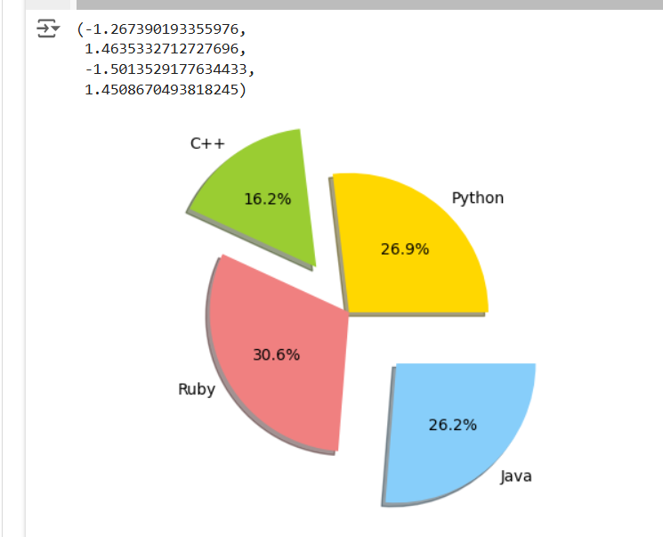

# EXNO-5-DS-DATA VISUALIZATION USING MATPLOT LIBRARY

# Aim:
  To Perform Data Visualization using matplot python library for the given datas.

# EXPLANATION:
Data visualization is the graphical representation of information and data. By using visual elements like charts, graphs, and maps, data visualization tools provide an accessible way to see and understand trends, outliers, and patterns in data.

# Algorithm:
STEP 1:Include the necessary Library.

STEP 2:Read the given Data.

STEP 3:Apply data visualization techniques to identify the patterns of the data.

STEP 4:Apply the various data visualization tools wherever necessary.

STEP 5:Include Necessary parameters in each functions.

# Coding and Output:
```py
import matplotlib.pyplot as plt
x=[0,1,2,3,4,5]
y=[0,1,4,9,16,25]
plt.plot(x,y)
```

```py
x_=[1,2,3]
y_=[2,4,1]
plt.plot(x_,y_)
plt.xlabel('x-axis')
plt.ylabel('y-axis')
plt.title('First Graph')
```

```py
x1=[1,2,3]
y1=[2,4,1]
plt.plot(x1,y1, label="line1")
x2=[1,2,3]
y2=[4,1,3]
plt.plot(x2,y2,label="line2")
plt.xlabel('x-axis')
plt.ylabel('y-axis')
plt.title('Two lines on same graph')
plt.legend()
```

```py
xx=[1,2,3,4,5,6]
yy=[2,4,1,5,2,6]
plt.plot(xx,yy,color='blue',linestyle='dashed',linewidth=3,marker='o',markerfacecolor='red',markersize=12)
plt.ylim(1,8)
plt.xlim(1,8)
plt.xlabel('x-axis')
plt.ylabel('y-axis')
plt.title('Customized Graph')
```

```py
years=range(2000,2012)
apples=[0.895,0.91,0.919,0.926,0.929,0.931,0.934,0.936,0.937,0.9375,0.9372,0.939]
oranges=[0.962,0.941,0.930,0.923,0.918,0.908,0.907,0.904,0.901,0.898,0.9,0.896]
plt.plot(years,apples)
plt.plot(years,oranges)
plt.xlabel('Year')
plt.ylabel('Tield(tons per hectare)');
plt.title("Crop Yields in Kanto")
plt.legend(['Apples','Oranges']);
```

```py
plt.plot(years,apples,marker='o')
plt.plot(years,oranges,marker='x')
plt.xlabel('Year')
plt.ylabel('Tield(tons per hectare)');
plt.title("Crop Yields in Kanto")
plt.legend(['Apples','Oranges']);
```


## Scatter plot
```py

x_values=[0,1,2,3,4,5]
y_values=[0,1,4,9,16,25]
plt.scatter(x_values,y_values,s=30,color='blue')
```

```py
import numpy as np
import pandas as pd
x=np.arange(0,10)
y=np.arange(11,21)
print(x)
print(y)
plt.scatter(x,y,c='r')
plt.xlabel('x-axis')
plt.ylabel('y-axis')
plt.title('Graph in 2D')
plt.savefig('Test.png')
```

```py
y=x*x
print(y)
```

```py
plt.plot(x,y,'g*',linestyle='dashed',linewidth=2,markersize=12)
plt.xlabel('x-axis')
plt.ylabel('y-axis')
plt.title('2D Diagram')
```

```py
x=np.arange(0,4*np.pi,0.1)
y=np.sin(x)
plt.title("sine wave form")
plt.plot(x,y)
plt.show()
```

```py
x=[1,2,3,4,5]
y1=[10,12,14,16,18]
y2=[5,7,9,11,13]
y3=[2,4,6,8,10]
plt.fill_between(x,y1,color='blue')
plt.fill_between(x,y2,color='green')
plt.plot(x,y1,color='red')
plt.plot(x,y2,color='black')
plt.legend(['y1','y2'])
plt.show()
```

```py
from scipy.interpolate import make_interp_spline
x=np.array([1,2,3,4,5,6,7,8,9,10])
y=np.array([2,4,5,7,8,8,9,10,11,12])
spl=make_interp_spline(x,y)
x_smooth=np.linspace(x.min(),x.max(),100)
y_smooth=spl(x_smooth)
plt.plot(x,y,'o',label='data')
plt.plot(x_smooth,y_smooth,'-',label='spline')
plt.legend()
plt.show()
```

## BarChart
```py
height=[10,24,36,40,5]
names=['one','two','three','four','five']
c1=['red','green']
c2=['b','g']
plt.bar(names,height,width=1,color=c2)
plt.xlabel('x-axis')
plt.ylabel('y-axis')
plt.title('My bar chart')
```

```py
x=[2,8,10]
y=[11,16,9]
x1=[3,9,11]
y1=[6,15,7]
plt.bar(x,y,color='r')
plt.bar(x1,y1,color='b')
plt.title('Bar Graph')
plt.xlabel('X-axis')
plt.ylabel('Y-axis')
plt.show()
```

```py
ages=[2,5,70,40,30,45,50,45,43,40,44,60,7,13,57,18,90,77,32,21,20,40]
range=(0,100)
bins=10
plt.hist(ages,bins,range,color='green',histtype='bar',rwidth=0.8)
plt.xlabel('age')
plt.ylabel('No. of people')
plt.title('My histogram')
```

```py
x=[2,1,6,4,2,4,8,9,4,2,4,10,6,4,5,7,7,3,2,7,5,3,5,9,2,1]
plt.hist(x,bins=10,color='blue',alpha=0.5)
plt.show()
```

```py
import numpy as np
import matplotlib.pyplot as plt
np.random.seed(0)
data=np.random.normal(loc=0,scale=1,size=100)
print(data)
```

## Matplot
```py
fig,ax=plt.subplots()
ax.boxplot(data)
ax.set_xlabel('Data')
ax.set_ylabel('Values')
ax.set_title('Box Plot')
```

```py
activities=['eat','sleep','work','play']
slices=[3,7,8,6]
colors=['y','b','r','g']
plt.pie(slices,labels=activities,colors=colors,startangle=90,shadow=True,explode=(0,0,0.1,0),radius=1.0,autopct='%1.1f%%')
plt.legend()
```

```py
labels='Python','C++','Ruby','Java'
sizes=[215,130,245,210]
colors=['gold','yellowgreen','lightcoral','lightskyblue']
explode=(0,0.4,0,0.5)
plt.pie(sizes,explode=explode,labels=labels,colors=colors,autopct='%1.1f%%',shadow=True)
plt.axis('equal')
```

```py
activities=['eat','sleep','work','play']
slices=[3,7,8,6]
colors=['r','y','g','b']
plt.pie(slices,labels=activities,colors=colors,startangle=90,shadow=True,explode=(0,0,0.1,0),radius=1.2,autopct='%1.1f%%')
plt.legend()
```


# Result:
Thus the program to Perform Data Visualization using matplot python library for the given datas is been implemented.
